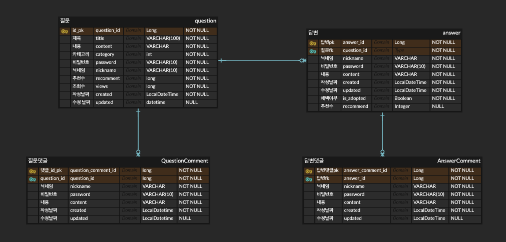

# mission-peerflow-BE
This is simple website Backend mission for searching 42 subject.

42슬랙 general채널은 너무 불편합니다. 그래서 여러분은 general 채널을 대신할 질문-답변 사이트를 만드려고 합니다. 해당 서브젝트를 완료하면 RESTful과 API에 대해 이해할 수 있게 됩니다.

---
## 🚀 기능 요구 사항
이 레포지토리를 fork한 후 main에서 나만의 peerflow 서버를 만들어봅시다. 
branch와 pull request를 적극 활용해보세요!
> demo/prod 브랜치는 사용하지 않습니다. 

### 메인 화면
- 메인 화면에는 모든 글에 대한 조회가 있어야 합니다.
- 카테고리는 minishell, ft_irc, push_swap등 자유롭게 하되 총 3개의 카테고리 종류가 있어야 합니다. 카테고리를 눌렀을 때 해당 카테고리의 글만 조회할 수 있어야 합니다.
- 검색과 정렬이 가능해야 합니다. 검색은 제목 검색만 구현합니다. 정렬은 최신순, 조회순, 추천순으로 정렬할 수 있게 해야합니다.
- 페이지네이션이 구현되어있어야합니다
- 글을 조회했을 때는 다음과 같은 정보가 나와야 합니다. 
  - example
    - 질문 제목
    - 카테고리
    - 답글수
    - 추천수
    - 조회수
    - 작성자 닉네임
    - 작성일
- 메인 화면에서 새 글 버튼을 통해 새로운 질문을 작성 할 수 있어야 합니다.

### 상세 글 조회
- 조회한 글 중 하나를 클릭하면 해당 글의 내용이 모두 나오도록합니다.
  - 해당 글의 내용에는 질문, 답글, 질문 댓글, 답글 댓글이 있습니다.
  - example
    - 질문
      - 질문 제목
      - 질문 내용
      - 질문 작성자 닉네임
      - 질문 작성일 (createdAt)
      - 질문 수정일 (updatedAt)
      - 카테고리
      - 추천수, 조회수
    - 답변들
      - 답변 작성자 닉네임
      - 내용
      - 답변 작성일
      - 답변 수정일
      - 추천수
      - 채택여부
- 상세 글을 조회하면 그 글의 조회수가 증가하여야 합니다.
- 상세 글은 질문, 답글, 질문 댓글, 답글 댓글이 있다.
- 각 글의 댓글들 또한 페이지네이션이 구현되어 있어야 합니다.
- 해당 글과 그의 답글들 모두 추천을 누를 수 있어야합니다.
- 상세 글 작성자는 채택 버튼을 통해 답글을 채택 할 수 있어야 햔다.
  - 채택 시 상세 글의 비밀번호를 검증해야 합니다.

### 글쓰기 및 댓글
- 글쓰기(질문, 답글)를 구현해야합니다.
  - 글 작성 시 반드시 제목, 내용, 닉네임, 비밀번호를 입력해야 합니다.
  - 글의 수정 및 삭제는 글의 비밀번호로 판단합니다.
- 댓글 쓰기를 구현해야합니다.
  - 질문과 그 질문의 모든 답글에 댓글을 달 수 있어야 합니다.
  - 댓글 작성 시 반드시 내용, 닉네임, 비밀번호를 입력해야 합니다.
  - 수정 및 삭제의 댓글의 비밀번호로 판단합니다.

> 늘 그랬듯 무조건 subject에 있는 그대로 구현해야하는 것은 아닙니다. 만들어보고 싶은 기능이 있다면 추가해도 좋고, 주어진 entity 양식이나, API 명세 및 백엔드 설계를 더 좋은 방향이라고 생각하는대로 수정해도 좋습니다. 지금은 학습을 위한 시간이니까요.

> 다만 메인페이지에서 저장된 글들을 조회하고, 질문-답글-댓글의 CRUD, 추천, 채택과 같은 기능은 구현해야 합니다.
  
---

## 참고 사항
1. 처음 Build를 위한 초기 설정과 db setting방법을 제공합니다. 
   - [초기 설정](https://github.com/peer-42seoul/mission-peerflow-BE/issues/1)
2. 협업을 위한 컨벤션을 지켜봅시다.
   - [컨벤션](docs/01-컨벤션.md)
3. 기본적으로 엔티티 예시를 제공합니다.  
   - 
4. 기본적으로 API 명세를 제공합니다.
   - 더 좋은 방향으로 수정해도 좋습니다.
   - [API 명세](https://www.notion.so/peer-study/peerflow-api-5898f07da57546669a021e033fea47e9?pvs=4)

---
## Bonus
- 더 안전한 서버를 만들기 위해 Junit을 위한 test code를 작성해봅시다. 
- request를 실패했을 때 error handling과 http error status을 고려해봅시다.
- 프론트와의 협업을 위해 swagger나, Spring REST docs를 적용해봅시다. 

> 하지만 당연하게도 이 세가지는 필수가 아닙니다. 기능 요구 사항을 모두 충족하고 시간이 남는다면 도전해보세요.

---
> 어떤 방식으로 구현하든 자유지만 왜 그렇게 구현했는지 스스로의 이유를 생각하면서 만들어봅시다!
